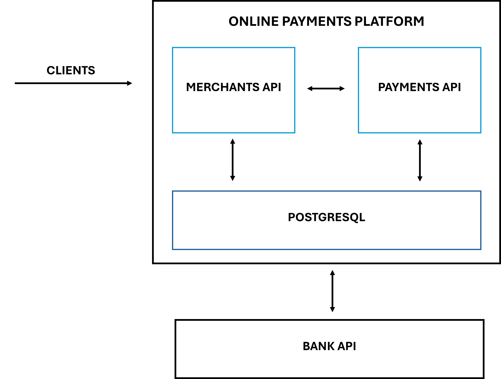

# Online Payments Platform

E-commerce platform that allows to register as a merchant, generate and search for payment orders and process them through the API of a simulated financial institution.

## Architecture

The architecture is deployed using Docker Compose and has the following components

- **Merchant API**. API service that allows to register and log in as a merchant.

- **Online Payment  API**. API service that allows you to make payment orders, process charges and refunds through a simulated banking entity.

- **PostgreSQL**. Database service used to persist merchants and payments information created through the platform.

- **Bank Simulator**. Service that allows to simulate communication with a banking entity to process charges and refunds transactions.

### Diagram



## API resources

For more information about the API resources supported by this service, click [here](./api_resources.md).

## Getting Started

Follow these instructions in order to be able to run the project locally or through a containerized environment.

### Prerequisites

#### Docker & Docker Compose

1. Follow the instructions found in the [official docs](https://docs.docker.com/get-docker/) to install Docker.
2. After installing Docker, follow the steps found in the [official docs](https://docs.docker.com/compose/install/) to install Docker Compose.

#### PostgreSQL (Optional)

In case you are interested in local development, follow these steps to install PostgreSQL:

1. Install PostgreSQL [here](https://www.postgresql.org/download/), depending on your OS.
2. Access PostgreSQL through the terminal using the default user: `psql postgres`.
3. Create the database for the platform and access it:

```sql
CREATE DATABASE payments_transactions;
CREATE DATABASE payments_merchant;
```

```

#### Golang

In case you are interested in local development, install the latest version of Golang found on the [official docs](https://go.dev/doc/install).

### Installing

Once you have installed the prerequisites above, run this command to get a copy of the project:

```git
git clone https://github.com/ffalconesmera/payments-platform.git
```

#### Environment Variables
 
Create `.env` files at `/merchants` and `/payments` directories based on the `.env.example` file in the same folders.

#### Development

In case you want to start local development, follow theses steps at  `/bank_simulator`, `/merchants` and `/payments` folders:

1. Install Go dependencies: `go mod download`
2. Execute run commad: `go run main.go`

## Running tests

In order to run the tests, run the following command at the root of the project:

```go
go test ./...
```

## Usage

In order to start the services composing the platform, run the following command at the root of the project:

```docker
docker-compose up --build
```

